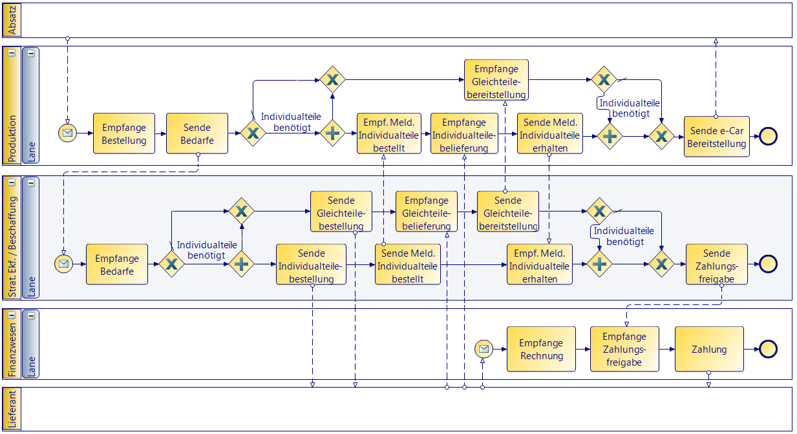
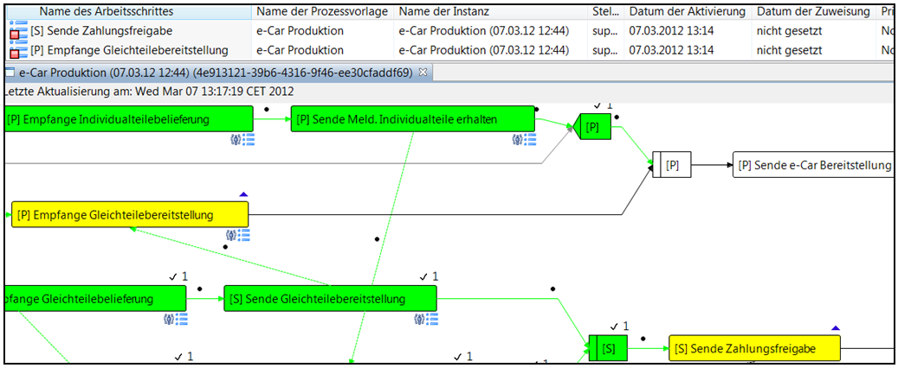
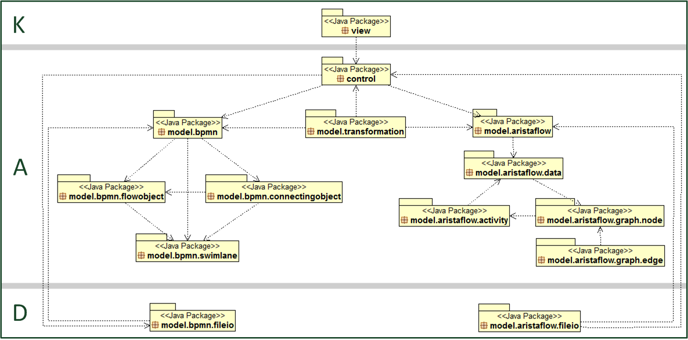

# AristaFlow Workflow Model Transformation Tool
Transformation of BPMN XPDL workflow models (XPDL v2.1) for the AristaFlow workflow management system (v1.0).

This tool implements a transformation mechanism for models based on the BPMN XPDL standard and generates executable workflow models for AristaFlow. 

## Usage

When opening the tool, an XPDL file can be opened, validated and selected for the transformation. When starting the transformation, it operations on the level of model elements and clusters of model elements, such that (1.) patterns of model-elements are identified in the XPDL model, (2.) clusters of elements are created for each pattern, (3.) conversions for each cluster are carried out according to the pattern.

### Input 

### Output

### Execution

## Tool Architecture

The tool is written in Java SE 7 and is structured according to the following layered architecture with UI (K), application logic (A) and data (D) components:

More details are available here:
https://www.researchgate.net/publication/322077882_Vom_hochflexiblen_Geschaftsprozess_zum_ausfuhrbaren_Workflowschema_fur_AristaFlow
